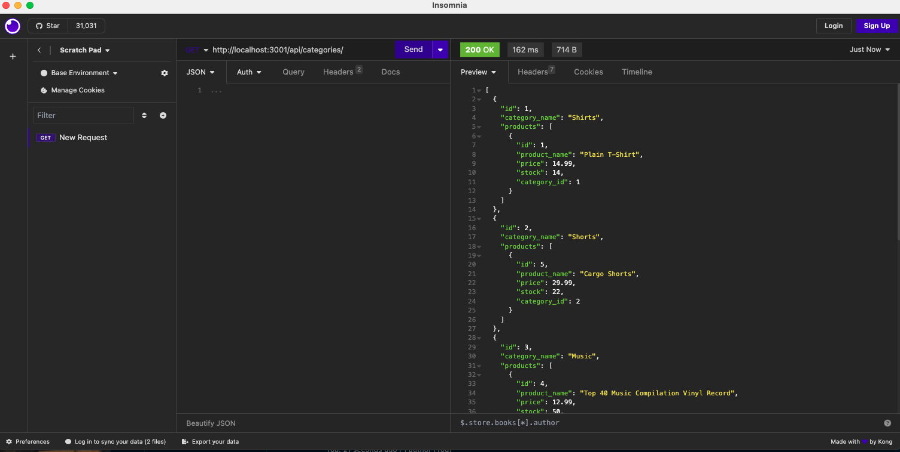

# EcommerceBackEnd
  

  ## Table of Contents
  *[Description](#description)  
  *[Installation](#Installation)  
  *[Usage](#usage)  
  *[Contribution](#contribution)  
  *[Tests](#tests)  
  *[Questions](#questions)  
  *[Credits](#credits)  

  ## Description 
  This project was built to test the backend of a ecommerce website and navigate between different routes. We were able to run and test on how to add, edit and delete user requests while seeing it real time. 

  ## Installation 
  Ensure you have node installed into your project and the following packages installed: dotenv, express, mysql2 and sequelize. In the video demonstration, I was using Insomnia to test all of our routes.

  ## Usage 
  This application allows the user to browse an online marketplace what is currently listed and able to edit current listings. Watch the video below!
  

  ## Licenses 
  
  This project is using the MIT license. To learn more, please click the license link listed above.

  ## Contribution 
  I had to reference class lessons as well as MDN on how routes worked inside of an application. We had starter code provided to us for this project from Xandromus (Xander Rapstine).

  ## Tests 
  No tests were built for this project. 

  ## Questions 
  Have any questions regarding this project?  
  Send me a message on...  
  Github: https://github.com/gabe-velasquez  
  Email: gabriel.velasquez0116@gmail.com  

  ## Credits 
  Gabe Velasquez
